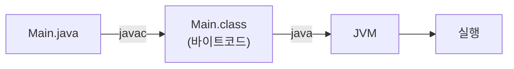
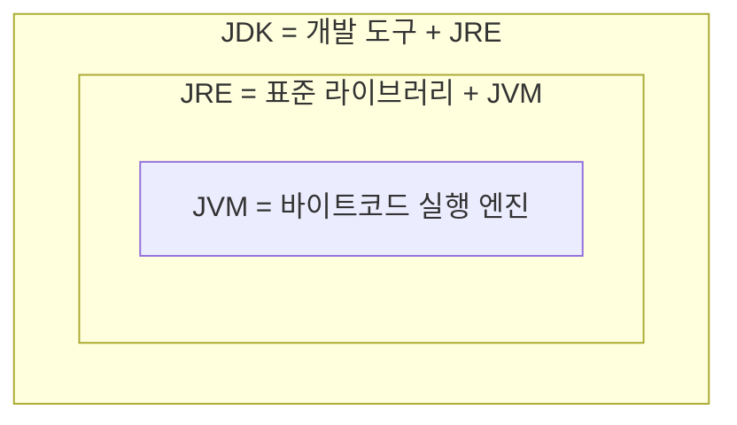
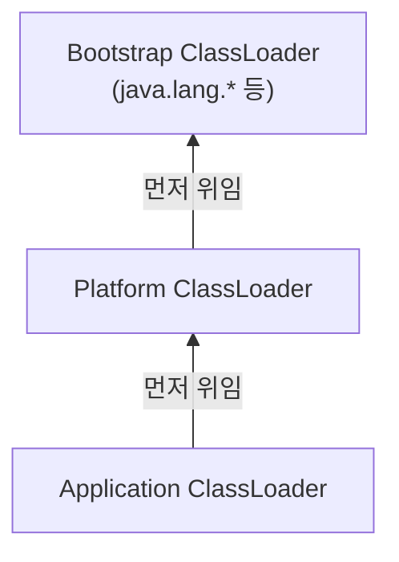

# Week 01. 자바 실행 구조

## 📌 학습 목표
- 자바 코드가 실행되기까지의 흐름(`.java` → `.class` → JVM → 실행)을 설명할 수 있다
- JDK / JRE / JVM의 관계를 구분할 수 있다
- 클래스 로더가 언제, 어떻게 동작하는지 개념 수준으로 안다

---

## 1. 자바 프로그램 실행 과정



- `javac`는 기계어가 아니라 **바이트코드**로 번역만 한다. 플랫폼별 차이는 JVM이 흡수한다 → 그래서 `.class` 파일 하나로 Windows/macOS/Linux 어디서든 실행된다.
- `java Hello.java`처럼 `javac` 없이 바로 실행되는 것처럼 보이는 경우(Java 11+)도 있는데, 이건 내부적으로 즉석 컴파일을 하는 것뿐이고 결과물(`.class`)을 디스크에 남기지 않는다.

**실습으로 확인한 것**

```bash
$ java Hello.class
Error: Could not find or load main class Hello.class
```
→ `java`에 넘기는 건 파일명이 아니라 **클래스 이름**이라 실패.

```bash
$ rm Hello.class && java Hello.java && ls
Hello          # 실행은 되지만 .class는 생성되지 않음
```

---

## 2. JDK / JRE / JVM


- JVM은 눈에 보이는 실제 프로그램이 아니라 "이렇게 동작해야 한다"는 규칙(명세) 이다. 이 규칙대로 만들어진 실제 프로그램이 HotSpot이고, 우리가 평소에 쓰는 JVM이 바로 이것이다.
- Java 11부터는 JRE만 따로 설치하는 방법이 없어졌다. 그래서 지금은 JDK 하나만 설치하면 된다.
- .class 파일 안에는 "이 파일을 몇 버전 JDK로 컴파일했는지"가 기록되어 있다.
- 예: JDK 21로 컴파일한 파일을 JDK 21이나 그 이상 버전에서 실행 → 정상 동작
- 예: JDK 21로 컴파일한 파일을 JDK 17에서 실행 → UnsupportedClassVersionError 발생 (더 낮은 버전은 더 높은 버전으로 컴파일된 파일을 못 읽음)`.이 찍혀있어서, **높은 JVM은 낮은 버전 파일을 실행 가능**하지만 반대(낮은 JVM ← 높은 버전 파일)는 `UnsupportedClassVersionError`.

---

## 3. 클래스 로더의 역할



- 클래스는 프로그램 시작 시 전부 로딩되는 게 아니라 **처음 쓰이는 순간**에 로딩된다.
- 로더는 계층 구조이며 요청이 오면 **상위로 먼저 위임**한다 → `java.lang.String`을 사용자가 위조해도 진짜가 먼저 로딩되어 무시됨 (표준 라이브러리 위조 방지).
- 로딩은 **로딩 → 링킹(검증/준비/해석) → 초기화** 세 단계로 나뉘고, `static` 변수는 준비 단계에서 기본값(0 등)으로 먼저 채워진 뒤 초기화 단계에서 실제 값이 들어간다.


---

## 💡 핵심 정리
- `javac`/`java` 분리 덕분에 한 번 컴파일한 결과물을 여러 플랫폼에서 실행 가능
- JDK ⊃ JRE ⊃ JVM, JVM은 명세이지 제품이 아님
- `.class` 버전은 하위 호환만 됨 (높은 JVM → 낮은 파일 O, 반대는 X)
- 클래스는 필요할 때 로딩되고, 로더 위임 구조가 표준 라이브러리를 보호함
