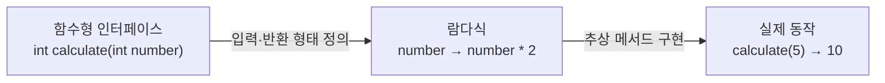
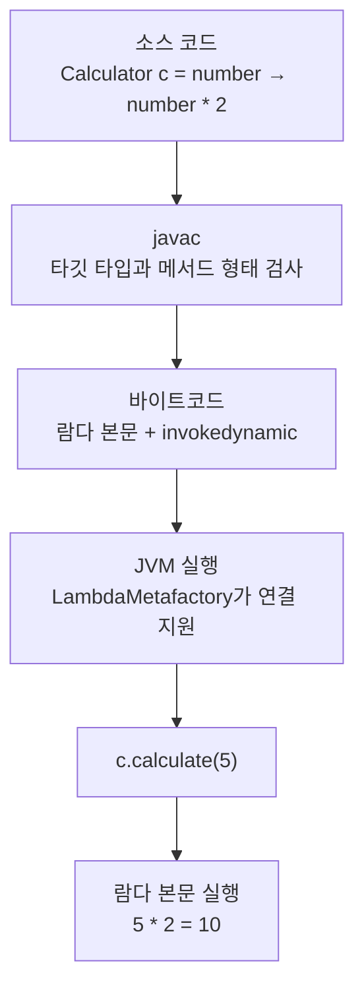
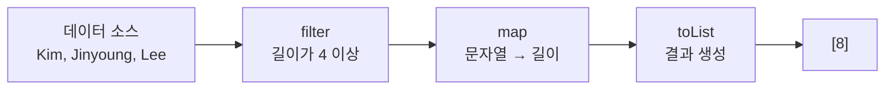
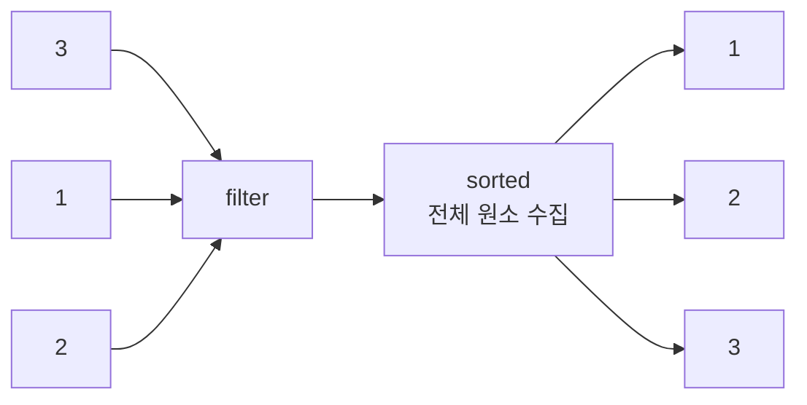

# 람다와 스트림

## 1. 람다식

람다식은 **함수형 인터페이스의 유일한 추상 메서드를 간결하게 구현하는 문법**이다.

```java
@FunctionalInterface
interface Calculator {
    int calculate(int number);
}

Calculator calculator = number -> number * 2;
int result = calculator.calculate(5); // 10
```

`calculate`는 `int` 하나를 받아 `int`를 반환한다는 메서드의 형태만 선언한다. 실제로 어떤 계산을 할지는 람다식이 정한다.

```text
int calculate(int number)
│   │         └─ 입력 타입
│   └─────────── 메서드 이름
└─────────────── 반환 타입

number -> number * 2
│          └──── 실제 실행할 동작과 반환값
└─────────────── 매개변수
```

람다의 기본 형태는 다음과 같다.

```java
// 매개변수가 없음
() -> "hello"

// 매개변수가 하나임
number -> number * 2

// 매개변수가 여러 개임
(a, b) -> a + b

// 실행문이 여러 개임
number -> {
    int result = number * 2;
    return result;
}
```

람다를 사용하면 동작을 변수에 저장하거나 메서드의 인수로 전달할 수 있다.

```java
static int execute(int number, Calculator calculator) {
    return calculator.calculate(number);
}

int doubled = execute(5, number -> number * 2);
int squared = execute(5, number -> number * number);
```

`execute`는 계산 방법을 직접 정하지 않고, 호출하는 쪽에서 전달한 동작을 실행한다.

---

## 2. 함수형 인터페이스와 추상 메서드

추상 메서드는 실행 내용 없이 **메서드 이름, 매개변수, 반환 타입만 선언한 메서드**이다.

```java
int calculate(int number);
```

함수형 인터페이스는 추상 메서드가 하나만 있는 인터페이스이다. 추상 메서드가 하나이므로 컴파일러는 람다가 어느 메서드의 구현인지 판단할 수 있다.



`@FunctionalInterface`는 필수는 아니지만, 추상 메서드가 하나라는 규칙을 컴파일러가 검사하게 한다.

```java
@FunctionalInterface
interface Calculator {
    int calculate(int number);

    default void print(int number) {
        System.out.println(number);
    }

    static String description() {
        return "계산기";
    }
}
```

함수형 인터페이스는 **추상 메서드만 하나**여야 한다. `default` 메서드와 `static` 메서드는 여러 개 있어도 된다.

### 표준 함수형 인터페이스

자바는 자주 사용하는 동작의 형태를 `java.util.function` 패키지에 제공한다.

| 인터페이스 | 동작의 형태 | 추상 메서드 | 사용 예 |
|---|---|---|---|
| `Function<T, R>` | `T`를 받아 `R` 반환 | `apply()` | 값 변환 |
| `Predicate<T>` | `T`를 받아 `boolean` 반환 | `test()` | 조건 검사 |
| `Consumer<T>` | `T`를 받고 반환하지 않음 | `accept()` | 출력, 값 사용 |
| `Supplier<T>` | 입력 없이 `T` 반환 | `get()` | 값 생성 |

```java
Function<String, Integer> length = text -> text.length();
Predicate<Integer> isEven = number -> number % 2 == 0;
Consumer<String> printer = text -> System.out.println(text);
Supplier<String> message = () -> "hello";
```

---

## 3. 람다가 컴파일되는 방식

컴파일러는 람다식의 왼쪽이나 메서드의 매개변수에서 **타깃 타입**을 알아낸다.

```java
Calculator calculator = number -> number * 2;
```

위 코드의 컴파일 과정은 다음과 같다.

1. 왼쪽의 타깃 타입이 `Calculator`인지 확인한다.
2. `Calculator`의 유일한 추상 메서드 `calculate`를 찾는다.
3. 추상 메서드와 람다의 매개변수·반환 타입이 일치하는지 검사한다.
4. 람다 본문을 실행 가능한 메서드 형태로 준비한다.
5. 바이트코드에 `invokedynamic` 호출 지점을 기록한다.
6. 실행 시 JVM이 함수형 인터페이스의 구현과 람다 본문을 연결한다.



람다는 사용 목적 면에서 익명 클래스를 간결하게 표현한 것과 비슷하지만, 컴파일 방식은 같지 않다. 익명 클래스는 일반적으로 별도의 클래스 형태로 컴파일되고, 람다는 주로 `invokedynamic`을 이용하여 실행 시점에 구현을 연결한다.

---

## 4. 스트림

스트림은 컬렉션 등의 데이터를 하나씩 흘려보내며 연속적으로 처리하는 도구이다. 데이터 처리 과정을 선언적으로 연결할 수 있다.

```java
List<String> names = List.of("Kim", "Jinyoung", "Lee");

List<Integer> lengths = names.stream()
        .filter(name -> name.length() >= 4)
        .map(name -> name.length())
        .toList();
```



스트림은 원본 컬렉션을 직접 변경하지 않는다. 스트림 파이프라인을 통해 새로운 결과를 만든다.

### 중간 연산

중간 연산은 데이터를 가공하고 다시 스트림을 반환한다. 스트림을 반환하므로 여러 연산을 이어서 호출할 수 있다.

| 메서드 | 역할 |
|---|---|
| `filter()` | 조건을 만족하는 값만 통과 |
| `map()` | 값을 다른 값으로 변환 |
| `sorted()` | 값을 정렬 |
| `distinct()` | 중복 제거 |
| `limit()` | 처리할 값의 개수 제한 |

```java
Stream<Integer> processed = names.stream()
        .filter(name -> name.length() >= 3)
        .map(name -> name.length())
        .sorted();
```

### 최종 연산

최종 연산은 스트림 처리를 끝내고 리스트, 숫자, `boolean`, `void` 등의 최종 결과를 만든다.

| 메서드 | 결과 |
|---|---|
| `toList()` | 값을 리스트로 수집 |
| `forEach()` | 각 값을 소비 |
| `count()` | 값의 개수 반환 |
| `findFirst()` | 첫 번째 값을 `Optional`로 반환 |
| `anyMatch()` | 조건을 만족하는 값이 있는지 반환 |
| `reduce()` | 여러 값을 하나로 누적 |

```java
long count = names.stream()
        .filter(name -> name.length() >= 4)
        .count();
```

중간 연산과 최종 연산은 반환 타입으로 구분할 수 있다.

```text
Stream을 반환 → 중간 연산
최종 결과 반환 → 최종 연산
```

최종 연산이 실행되면 해당 스트림 파이프라인은 소비된다. 같은 스트림 객체를 다시 사용할 수는 없지만, 원본 컬렉션에서 새로운 스트림을 생성할 수는 있다.

---

## 5. 지연 평가

스트림의 중간 연산은 호출되는 즉시 데이터를 처리하지 않는다. 중간 연산은 처리 계획을 연결하고, **최종 연산이 호출될 때 실제 처리를 시작**한다.

```java
Stream<String> stream = names.stream()
        .filter(name -> name.length() >= 4)
        .map(name -> name.toUpperCase());

// 이 시점까지 실제 데이터 처리는 시작되지 않음
List<String> result = stream.toList();
```

`filter()`와 `map()`처럼 원소 하나만으로 처리할 수 있는 연산은 각 원소가 파이프라인을 따라 이동한다.

```text
Kim      → filter(false) → 종료
Jinyoung → filter(true)  → map(JINYOUNG) → 결과
Lee      → filter(false) → 종료
```

따라서 모든 값에 `filter()`를 적용한 뒤 모든 결과에 `map()`을 적용하는 방식과 다르다.

`sorted()`처럼 전체 데이터가 필요한 연산은 모든 원소를 모은 뒤 처리한다.



`findFirst()`, `anyMatch()` 등은 결과가 결정되면 남은 데이터를 처리하지 않는다. 이를 단축 평가라고 한다.

```java
boolean exists = List.of(1, 2, 3, 4, 5).stream()
        .anyMatch(number -> number > 2);
```

`3`에서 결과가 `true`로 결정되므로 `4`와 `5`는 검사하지 않아도 된다.

---

## 6. 스트림과 반복문의 성능

스트림은 데이터 처리 과정을 읽기 좋게 표현할 수 있지만 항상 반복문보다 빠른 것은 아니다.

### 스트림이 느려질 수 있는 경우

- 데이터가 적고 처리 내용이 단순한 경우
- 람다와 스트림 파이프라인 구성 비용이 실제 계산보다 큰 경우
- `Integer`와 `int` 사이의 박싱·언박싱이 반복되는 경우
- 여러 중간 연산을 거치면서 호출 비용이 누적되는 경우

```java
int sum = numbers.stream()
        .map(number -> number * 2)
        .reduce(0, (a, b) -> a + b);
```

`Stream<Integer>`는 객체를 다루므로 숫자 계산 과정에서 박싱과 언박싱이 발생할 수 있다.

```text
int → Integer: 박싱
Integer → int: 언박싱
```

숫자 계산에는 기본형 특화 스트림을 사용해 불필요한 박싱을 줄일 수 있다.

```java
int sum = numbers.stream()
        .mapToInt(Integer::intValue)
        .sum();
```

자바는 `IntStream`, `LongStream`, `DoubleStream`을 제공한다. 성능이 중요한 코드는 추측으로 결정하지 않고 실제 실행 환경에서 측정해야 한다.

| 스트림이 적합한 경우 | 반복문이 적합한 경우 |
|---|---|
| 변환 과정이 명확하게 이어지는 경우 | 단순한 연산의 성능이 중요한 경우 |
| 필터링·변환·수집이 중심인 경우 | 인덱스를 직접 제어해야 하는 경우 |
| 코드의 선언적인 가독성이 중요한 경우 | 복잡한 상태 변경이나 제어 흐름이 필요한 경우 |

---

## 7. Optional

`Optional<T>`는 `T` 타입의 값이 있거나 없는 상태를 표현하는 객체이다. 예외 처리기라기보다 **결과가 없을 가능성을 반환 타입에 드러내는 도구**이다.

```text
Optional<User>
├─ User 값이 있음
└─ 값이 없음
```

```java
Optional<String> name = Optional.of("Jinyoung");
Optional<String> empty = Optional.empty();
```

`Optional.of()`는 값이 확실히 있을 때 사용하며 `null`을 전달하면 예외가 발생한다. 값이 `null`일 수도 있다면 `Optional.ofNullable()`을 사용한다.

```java
Optional<String> name = Optional.ofNullable(nullableName);
```

### 값이 없는 경우 처리

| 메서드 | 값이 없을 때의 처리 |
|---|---|
| `orElse(value)` | 기본값 반환 |
| `orElseGet(supplier)` | 필요한 시점에 기본값 생성 |
| `orElseThrow(supplier)` | 예외 발생 |
| `ifPresent(consumer)` | 값이 있을 때만 동작 실행 |
| `map(function)` | 값이 있을 때만 변환 |

```java
String name = optionalName.orElse("이름 없음");

int length = optionalName
        .map(String::length)
        .orElse(0);
```

`get()`은 값이 없으면 `NoSuchElementException`을 발생시키므로 무조건 값을 꺼내는 방식으로 남용하지 않는다.

```java
// 값이 없으면 예외가 발생하므로 지양
String name = optionalName.get();
```

스트림의 `findFirst()`처럼 결과가 없을 수 있는 최종 연산은 `Optional`을 반환한다.

```java
String name = names.stream()
        .filter(value -> value.startsWith("J"))
        .findFirst()
        .orElse("이름 없음");
```

`Optional`은 주로 결과가 없을 수 있는 메서드의 반환 타입에 사용한다. 컬렉션 결과는 `Optional<List<T>>`보다 빈 컬렉션을 반환하는 편이 단순하다.

---

## 8. 핵심 정리

1. 람다는 함수형 인터페이스의 유일한 추상 메서드를 구현한다.
2. 함수형 인터페이스는 동작의 입력과 반환 형태를 정의한다.
3. 람다는 주로 `invokedynamic`을 이용해 실행 시점에 인터페이스 구현과 연결된다.
4. 스트림의 중간 연산은 스트림을 반환하고, 최종 연산은 최종 결과를 만든다.
5. 중간 연산은 최종 연산이 호출될 때 실행되는 지연 평가 방식으로 동작한다.
6. 스트림은 가독성에 장점이 있지만 파이프라인과 박싱 비용으로 반복문보다 느릴 수 있다.
7. `Optional`은 값이 없을 가능성을 명시하며 `get()`보다 상황에 맞는 처리 메서드를 사용한다.
